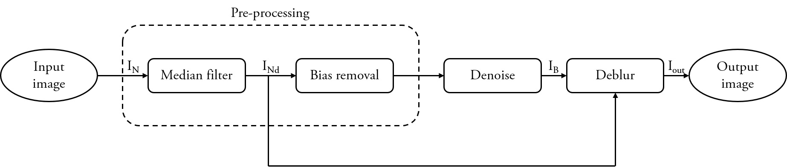
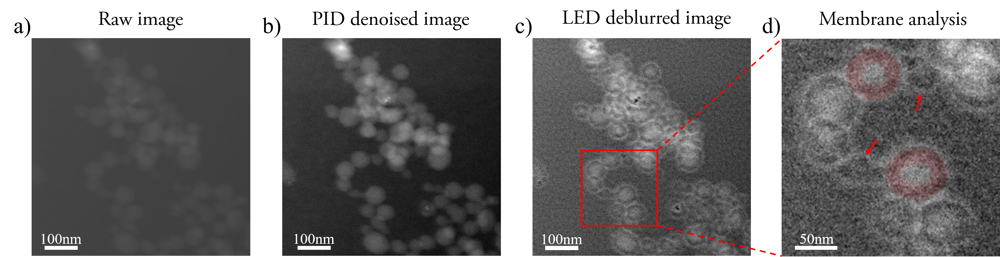

# End-to-end Image Analysis Pipeline for Liquid Transmission Electron Microscopy Imaging 
 
Gabriele Marchello, Cesare De Pace, Aroa Duro-Castano, Giuseppe Battaglia, Lorena Ruiz-Perez  
  
Liquid phase transmission electron microscopy allows the imaging of materials in liquid environments. The sample is encapsulated within electron-beam transparent windows and hence protected by the ultra-high vacuum necessary within the electron gun. Such an approach allows us to study biological and soft materials in their natural environment and offers the possibility of accessing their dynamic nature. Yet, the electron beam scattering from the windows and solvent increases the image noise and blur. Herein, we propose a pipeline to both de-noise and sharpen images obtained by liquid transmission electron microscopy. We develop the workflow in a way that it does not require any human interference, nor introduce artefacts, but actually unveils features of the imaged samples covered by the noise and the blur.

The approach proposed in this work is a two-stage single input pipeline, aiming to recover the noiseless image Iout from the noisy image IN. The first stage of the pipeline is responsible for identifying and suppressing the noise, whilst the second stage restores the sharpness of the image, estimating and removing the blurring function.  
  

The most significant outcome achieved by the proposed image analysis method arises in its ability to unveil details in images of organic materials obtained by LTEM, details that are otherwise hidden below noise and blur effects.  

The noisy raw image in Fig. _a_ depicts PEG-PMET vesicles and micelles in solution obtained via LTEM in STEM mode. The raw image _a_ displays aggregation of spherical nanoparticles, but it is not possible to discern whether the nanostructures are membrane-bound _i.e._ vesicles or solid-core spherical structures _i.e._ micelles. Image _b_ corresponds to the denoised image, and _c_ to the deblurred image. _d_ depicts a zoomed region of the deblurred _c_, containing vesicles surrounded by membranes.  

# Implementation
